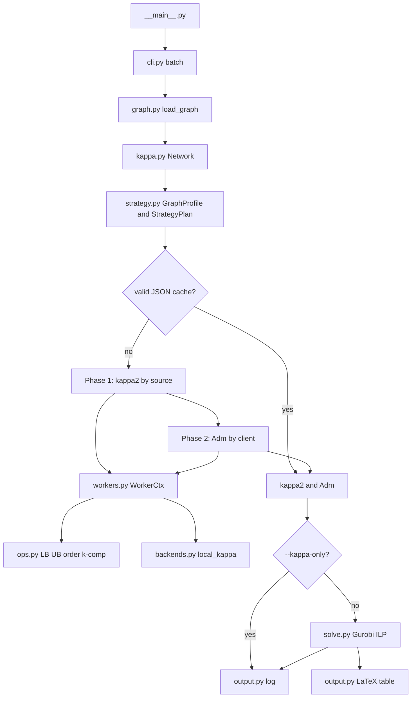

# MaxC — minimum number of servers with maximum connectivity

Additional code in the RP-MaxC repository: a **parallel** solver for **only** the
minimum number of MaxC servers. κ queries use **SciPy** (default); the ILP uses
**Gurobi**. Run as `python -m maxc` with the **parent** of `maxc` on `PYTHONPATH`
(the repository root).

Gurobi is licensed separately. Set `GRB_LICENSE_FILE` to your `gurobi.lic`, or
place a local `gurobi.lic` next to this package. **No license file is shipped.**

## Requirements

**Required**

- Python 3.10+
- `networkx` — graphs and the auxiliary digraph for κ
- `scipy` — max-flow for each κ query (**default** backend)
- `gurobipy` — ILP in `solve.py` (set `GRB_LICENSE_FILE` to your Gurobi license)

**Optional**

- `python-igraph` — only with `--flow-backend igraph`

```bash
pip install networkx scipy gurobipy
# optional:
pip install python-igraph
```

## How to run

The default for `--workers` is `cpu_count()-1` (one core reserved for the OS). Values above the cap are reduced.

The default stack is **SciPy** for κ flow and **Gurobi** for the ILP (the ILP is skipped only with `--kappa-only`). The final κ remains **exact**. Shortcuts (structural LB, smart ordering, …) follow a fixed default plan; individual flags override it.

```bash
# In the directory that contains the maxc/ folder (package parent):
cd /path/to/parent
# or: export PYTHONPATH=/path/to/parent

# Small suite — SciPy + Gurobi (default)
python -m maxc --input usados --output archive_maxc_test --no-cache

# One file, 7 workers
python -m maxc --workers 7 --no-cache --files usados/AsnetAm.gml

# κ₂/Adm only (does not call Gurobi)
python -m maxc --kappa-only --no-cache --files usados/AsnetAm.gml

# Large graph
python -m maxc --workers 31 --no-cache \
  --files ../archive/600_midtown_manhattan_nyc.dimacs --kappa-only
```

Useful parameters:

- `--workers N` — parallel processes (default and cap: `cpu_count()-1`)
- `--flow-backend scipy|networkx|igraph` — default: **scipy**
- `--input DIR` — graph folder (`.gml` / `.dimacs`)
- `--output DIR` — aggregated table folder
- `--files ...` — specific files
- `--min-n N` — only graphs with at least N vertices
- `--no-cache` — ignore / do not write `*_maxc_admissible.json`
- `--kappa-only` — compute only κ₂/Adm (do not call Gurobi)

## Default plan and strategy flags

Before computing κ, the program runs an **$O(n+m)$ pre-analysis**
(`maxc.strategy.analyze_graph_profile`) — density, degrees, blocks — and builds a
`StrategyPlan`. The pre-analysis does **not** pick a profile: the base plan is always the same.
The final κ remains **exact**; the plan only toggles shortcuts and backends.
Degrees and blocks are reused in `Network` (not recomputed).

**Fixed default**

- κ flow: `flow_backend=scipy` (required; no silent fallback to NetworkX)
- ILP: Gurobi (`solve.py`), unless `--kappa-only`
- structural LB **on**, smart ordering **on**, k-components **off**
- residual **off** and cut-UB **off** (only take effect with `--flow-backend networkx`)

The log prints a `STRATEGY PLAN` block with source `(default)` on each inherited decision, or `(cli)` if you overrode it.

**k-components is experimental:** even with `--k-components`, the index is skipped if $n \ge 80$ (and also if $n\cdot\max k$ exceeds the budget or `nx.k_components` takes more than 10 s).

### Individual flags (tri-state)

Omitting the flag = default plan (SciPy). `--foo` / `--no-foo` force it. None of them changes the value of κ or Adm — only time and memory.

**Residual** (`--reuse-residual` / `--no-reuse-residual`)

Reuses the NetworkX residual network between κ queries in the same worker. Speeds up successive flows on the auxiliary digraph. **Only takes effect** with `flow-backend=networkx`. Default: off.

**Flow algorithm** (`--flow-algorithm edmonds_karp|shortest_augmenting_path`)

Chooses the inner max-flow for local κ (via NetworkX `flow_func`). Only used with `--flow-backend networkx`. `edmonds_karp` usually does well on sparse graphs; `shortest_augmenting_path` on dense ones. Default: `edmonds_karp`. Does not change the value of κ.

**Cut upper bounds** (`--cut-upper-bounds` / `--no-cut-upper-bounds`)

After a flow, tries to extract a vertex cut from the residual and propagates $\kappa(u,v)\le k$ to pairs on opposite sides of the cut (`pair_ub`). In Phases 1/2, candidates with UB $\le$ the current LB are pruned without a new flow. Extraction only with a NetworkX residual and $k\le 3$. Default: off.

**Structural lower bounds** (`--structural-lower-bounds` / `--no-structural-lower-bounds`)

Flow-free shortcuts: if $\deg(u)=1$ or $\deg(v)=1$, then $\kappa=1$; if $u\sim v$ and they share a neighbor, $\kappa\ge 2$. Can certify leaves ($\kappa_2=1$) and mark admissible pairs without a flow query. Default: on.

**k-components** (`--k-components` / `--no-k-components`)

In Phase 2, restricts candidates to the intersection of the biconnected block with a $k$-connected component that contains the client (`nx.k_components`). On small networks this can shrink searches; at $n\ge 80$ (almost all of Topology Zoo) the index is **skipped** on a time budget. Default: off.

**Smart ordering** (`--smart-ordering` / `--no-smart-ordering`)

Orders candidates to maximize early-stop and cache hits: cached pairs first, then witnesses/neighbors with a hopeful LB, and pushes to the end anyone with UB $\le$ the best LB. Without smart order: neighbor → decreasing degree. Default: on.

**Flow backend** (`--flow-backend networkx|scipy|igraph`)

Where each $\kappa(u,v)$ query runs:

- `scipy` — **default.** Max-flow on the CSR matrix of the auxiliary digraph (built once in the worker); `cutoff` only caps the value after the full flow. Without SciPy the program **aborts** (no fallback to NetworkX).
- `networkx` — `local_node_connectivity` with auxiliary + residual + native `cutoff`. Required for residual and cut-UB.
- `igraph` — `vertex_connectivity` on a graph built once per worker (`pip install python-igraph`).

Override example:

```bash
python -m maxc --flow-backend networkx --cut-upper-bounds --k-components \
  --files usados/AsnetAm.gml --no-cache --kappa-only
```

On **every** graph the log prints `STRATEGY PLAN` (before κ and again in the summary).
Extra metrics: `flow_queries`, `cache_hits`, `ub_prunes`, `lb_shortcuts`.

## Program flow

The batch walks each graph in the same order: load → default plan (SciPy) →
compute κ₂ and Adm (or read the cache) → optionally solve the ILP (Gurobi) → write log/table.
No lower module calls a higher one: dependencies only go forward.



### How the files relate

| File | Role in the flow | Why it is separate |
|---|---|---|
| `__main__.py` | `python -m maxc` calls `cli.main` | package entrypoint |
| `cli.py` | flags, file list, batch loop | orchestrates; does **not** compute κ |
| `graph.py` | GML/DIMACS → connected undirected graph, nodes `0..n-1` | load/validation; does **not** choose strategy |
| `strategy.py` | $O(n+m)$ pre-analysis + default SciPy plan | shortcuts/backends; does **not** approximate κ |
| `kappa.py` | `Network`: cache, regions, Phases 1/2, metrics | orchestrates κ₂/Adm; does **not** read the graph file |
| `workers.py` | `WorkerCtx` + tasks `phase1_source_round` / `phase2_client` | picklable child-process code |
| `ops.py` | structural LB, cut/UB, ordering, k-components | compute primitives; does not decide the plan |
| `backends.py` | one `local_kappa(u,v)` (NetworkX / SciPy / igraph) | only runs the flow; the plan chooses the backend |
| `solve.py` | Gurobi ILP: min $|S|$ with $i\in\mathrm{Adm}(j)$ | does not recompute κ |
| `output.py` | per-instance/session log + `tableMaxC_min_servers.tex` | result I/O |

Import chain (forward only):
`cli` → `graph` / `kappa` / `solve` / `output`;
`kappa` → `strategy` / `workers`;
`workers` → `ops` / `backends`.
`cli` does `G = load_graph(path)` and `Network(G, source_path=path).compute_kappa()`.

### 1. Entry — `__main__.py` and `cli.py`

`python -m maxc` enters `cli.main`. The CLI resolves the graph list
(`--files` or all `.gml`/`.dimacs` in `--input`), the number of workers
(default and cap: `cpu_count()-1`), and whether the ILP runs (`--kappa-only` skips Gurobi).

**Why.** The package processes a **batch**, not a single graph. Reserving one
core for the OS keeps the machine responsive during the process pool. Each loop
iteration is independent: failure or skip (`--min-n`) of one file does not block the next.

### 2. Load — `graph.py`

`load_graph` reads GML (`label='id'`) or DIMACS (`a u v` lines), requires a
**connected** **undirected** graph, relabels nodes to `0..n-1` with
`ordering='increasing degree'` (original label in `nome`) and opens the log
`*_N_maxc_only.txt`.

**Why.** Some Topology Zoo graphs have duplicate `'?'` labels — the GML `id`
is unique. Degree-increasing numbering stabilizes caches and comparisons across
runs. Connected + undirected is the contract for κ and the ILP (symmetry
$\kappa(u,v)=\kappa(v,u)$, $\kappa_2\ge 1$).

### 3. Pre-analysis — `strategy.py` via `Network._resolve_strategy`

Before any flow, `build_strategy_plan` measures density, degrees, leaves, and
blocks ($O(n+m)$) and applies the **default plan** (SciPy + fixed shortcuts), then
CLI overrides. Degrees and blocks from `GraphProfile` are **reused** in `Network`
(`degree` and `biconnected_components` are not recomputed).

**Why.** Pre-analysis is cheap and avoids recomputing structures used in the
phases. The SciPy backend and flags change time/memory, **not** the value of κ.
There is no profile heuristic: the default is always the same.

### 4. JSON cache — `kappa.py`

If `--no-cache` was not passed and `*_maxc_admissible.json` exists with the expected
keys (`kappa_time`, `kappa2`, `admissible`, …), `compute_kappa` loads
κ₂ and Adm and **skips** Phases 1 and 2. Invalid or incomplete cache is ignored and
computation continues.

**Why.** The ILP only needs κ₂ and $\mathrm{Adm}(j)=\{i:\kappa(j,i)=\kappa_2(j)\}$,
not the κ matrix. Recomputing flows every run would be wasteful when the graph did not change.

### 5. Block-cut regions — `kappa._build_block_regions`

From the blocks already measured in pre-analysis, for each $v$ define $R(v)=$ the union
of the biconnected components that contain $v$. That region goes into `WorkerCtx` for
both phases.

**Why.** An articulation $c$ with $s$ and $t$ on opposite sides implies
$\kappa(s,t)\le 1$. If $\kappa_2(s)\ge 2$, candidates outside $R(s)$ **never**
improve κ₂ or enter Adm — there is no point flowing to them. The invariant
is in [Vertex cuts](#vertex-cuts-block-cut).

### 6. Phase 1 — κ₂ (`kappa._phase1_kappa2_waves` + `workers.phase1_source_round`)

Each **task is a source** $s$, not a pair $(s,t)$. The process pool builds
the auxiliary digraph **once** (and the NX residual, if the plan asks) in
`WorkerCtx`. Sources with $\deg(s)=1$ finish with $\kappa_2=1$ and no flow.

The parent dispatches **waves** of size equal to the worker count. After each
wave it merges `pair_cache`, `pair_ub`, and witnesses; certifies by degree
($\underline{\kappa}_2(v)\ge\deg(v)$ ⇒ $v$ does not enter later waves).
Inside the task: candidates only in $R(s)$, ordered (smart order or neighbor/degree),
prune by cut UB, structural shortcut, otherwise `local_kappa` with
`cutoff=\deg(s)`. Early-stop when `best == deg(s)`.

In Phase 1 `pair_cache` **goes in the payload** (it grows between waves; the pool
initializer runs only once).

**Why.** κ₂ is a **maximum**, not a matrix: one witness that reaches
$\deg(s)$ is enough, not every pair. Per-source tasks reuse the expensive auxiliary; waves
spread the undirected cache to later sources (symmetry
$\kappa(i,j)=\kappa(j,i)$). Cutoff and bilateral certification drop sources without
changing the value. Details in [Degree bound](#degree-bound) and
[Symmetry](#symmetry-in-undirected-graphs).

### 7. Phase 2 — Adm (`kappa._phase2_admissible` + `workers.phase2_client`)

For each client $j$, $\mathrm{Adm}(j)=\{i:\kappa(j,i)=\kappa_2(j)\}$, always
including $j$ (self-assignment). If $\kappa_2(j)=1$ and $G$ is connected,
$\mathrm{Adm}(j)=V$ **with no flow**. Otherwise candidates stay in
$R(j)$ (and, if the plan enables k-components and the index is not skipped, in the
intersection with the $k$-connected component). `cutoff` is now $\kappa_2(j)$:
only a tie with the already-known maximum matters.

Here `pair_cache` / `pair_ub` go in the **initializer** (stable snapshot; they
are not pickled in each payload). Then the parent applies symmetric seeding:
if $i\in\mathrm{Adm}(j)$ and $\kappa_2(i)=\kappa_2(j)$, then $j\in\mathrm{Adm}(i)`.

**Why.** The ILP only needs these pairs. κ₂=1 is the case where “everyone
is admissible” — flowing would be a useless $\Theta(n)$ per client. Phase 1’s cache
already resolves many pairs; Phase 2 only queries what is still missing.

### 8. One κ query — `backends.local_kappa` and shortcuts in `ops.py`

Every flow query goes through `local_kappa`: NetworkX (native `cutoff` + residual),
SciPy (CSR of the auxiliary; cutoff only as a post-flow cap) or igraph (graph
pre-built in the worker). Before that, `ops.structural_kappa_lb` can
certify $\kappa=1$ (leaf) or $\kappa\ge 2$ (edge + common neighbor).
After an NX flow with $k\le 3$, `extract_node_cut_from_residual` +
`propagate_cut_ubs` fill `pair_ub` to prune other pairs.

**Why.** The three backends return the **same** integer; only the cost changes.
Shortcuts and UBs skip the query when theory already pins the value or proves the
candidate cannot improve the LB/target.

### 9. ILP — `solve.py`

Unless `--kappa-only`, `run_min_servers` builds

$$
A=\{(i,j): i\in\mathrm{Adm}(j)\}
$$

and solves $\min |S|$ subject to: each client $j$ assigned to exactly one $i\in\mathrm{Adm}(j)$,
and $x_{ij}\le$ “$i$ is open”. In this program $S=C=V$ (every vertex is a client
and a server candidate), so `server_var(i) = x[i,i]`: self-assignment
$\kappa(i,i):=\kappa_2(i)$ is already in Adm, and the $y_i$ variables are redundant.

**Why.** $A$ is exactly the set of assignments with the client’s maximum
connectivity — the only feasible set for minimum RP-MaxC. The κ matrix and distances
are not needed.

### 10. Output — `output.py`

Each instance mirrors the log to stdout, `*_N_maxc_only.txt`, and the session
`log_maxc_only.txt`. Without `--kappa-only`, the batch adds one row
per graph in `tableMaxC_min_servers.tex` (`--output`). The cache
`*_maxc_admissible.json` (next to the graph) stores κ₂, Adm, and metrics for the
next run.

**Why.** A per-file log lets you inspect STRATEGY PLAN, `#flows`, and
timings for one graph; the table compares the batch; the JSON avoids repeating the expensive part.

## Problem

Given a connected undirected graph $G=(V,E)$, let

$$
\kappa(u,v)=\text{local vertex connectivity between }u\text{ and }v,
\qquad
\kappa_2(v)=\max_{u\in V}\kappa(v,u)
$$

(with the convention $\kappa(v,v)=\kappa_2(v)$, allowing self-assignment).

**RP-MaxC (minimum number of servers):**

- open a set $S\subseteq V$ of resources (servers);
- assign each client $j\in V$ to a server $i\in S$ with $\kappa(j,i)=\kappa_2(j)$;
- minimize $|S|$.

This program solves **only** that variant.

The sections below justify the pruning in the flow (degree, block-cut, symmetry).
The flow above shows **where** each invariant is used.

## Why it is correct

### Degree bound

$$
\kappa(s,t)\le\min(\deg(s),\deg(t))
\quad\Rightarrow\quad
\kappa_2(v)\le\deg(v).
$$

Consequences:

- `cutoff=deg(s)` in Phase 1 does not change the value of κ.
- If at any point `best == deg(s)`, then $\kappa_2(s)=\deg(s)$ and the search for that source can stop.
- If $\deg(i)<\kappa_2(j)$, then $i\notin\mathrm{Adm}(j)$.

### Vertex cuts (block-cut)

If $C\subset V$ separates $i$ and $j$ in $G-C$, then $\kappa(j,i)\le|C|$.

In MaxC, assignment requires $\kappa(j,i)=\kappa_2(j)$. So if $\kappa_2(j)>|C|$, a server $i$ on the other side of the cut is **never** admissible.

Practical case $|C|=1$ (articulations / biconnected components):

- define $R(j)=$ the union of the biconnected blocks that contain $j$;
- if $\kappa_2(j)\ge 2$, it is enough to search Adm (and the maximum that defines κ₂) inside $R(j)$;
- if $\kappa_2(j)=1$ and $G$ is connected, then $\kappa(j,i)\ge 1$ for every $i$, so $\mathrm{Adm}(j)=V$ **with no extra flow**.

### Symmetry in undirected graphs

Because $G$ is undirected, $\kappa(i,j)=\kappa(j,i)$. Consequences:

1. **Unordered pair:** a single flow determines κ for $(i,j)$ and $(j,i)$; the program keeps a cache keyed by $(\min,\max)$.
2. **Bilateral lower bound:** after $\kappa(i,j)=k$, $\underline{\kappa}_2$ is updated at both $i$ and $j$.
3. **Degree certification:** if $k=\deg(v)$, then $\kappa_2(v)=\deg(v)$ and $v$ leaves later Phase 1 waves.
4. **Adm is not symmetric in general:** $i\in\mathrm{Adm}(j)$ and $\kappa_2(i)=\kappa_2(j)$ ⇒ $j\in\mathrm{Adm}(i)$; if the $\kappa_2$ values differ, inclusion one way does not imply the other.

Phase 1 processes each source **once**, in waves (size ≈ number of workers): after each wave the parent merges the cache. Phase 2 reads the same cache (in the pool initializer) and applies symmetric Adm seeding.

## Why κ computation is fast

Reasons in the current pipeline (none of them changes the value of κ or $p$):

1. **Fewer flows** — only queries pairs that can still improve κ₂ or enter Adm; does not fill the matrix.
2. **Cheaper flows** — `cutoff` by degree (Phase 1) or by κ₂ (Phase 2) stops max-flow early.
3. **κ₂ early-stop** — stops source $s$ upon reaching $\deg(s)$.
4. **Block-cut** — shrinks candidates when $\kappa_2\ge 2$.
5. **Undirected symmetry** — one cache per unordered pair + bilateral certification + waves (source $t$ can leave the queue if a flow with $s$ already matched $\deg(t)$).
6. **Per-source parallelism** — each process reuses auxiliary/residual/CSR/igraph in `WorkerCtx`.
7. **Phase 2** — `pair_cache` in the initializer (not pickled in each payload).

The theoretical worst case can still need almost $\Theta(n^2)$ tests (dense / highly connected graph). For $n>500$ the viable path is this pipeline (fewer queries + cutoff), not enumerating every pair.

Log metrics: `t_phase1`, `t_phase2`, `#flows`, and the ratio `#flows / (n(n-1)/2)`.

## How to validate

1. **Regression (small graphs):** folder `usados/` (Topology Zoo). Check $p$ and, when a cache exists, `kappa2`/`Adm` in `*_maxc_admissible.json`.
2. **Scale:** graphs with $|V|>500$ (e.g. OSMnx `.dimacs`) and many workers on a powerful machine; report timings and the flow ratio above.

## Limitations / out of scope

- Speeding up or reformulating Gurobi beyond using `admissible`.
- MaxC variants by distance, p-median, gaps.
- Full κ matrix.
- **Approximate** connectivity heuristics (they would change $p$).
